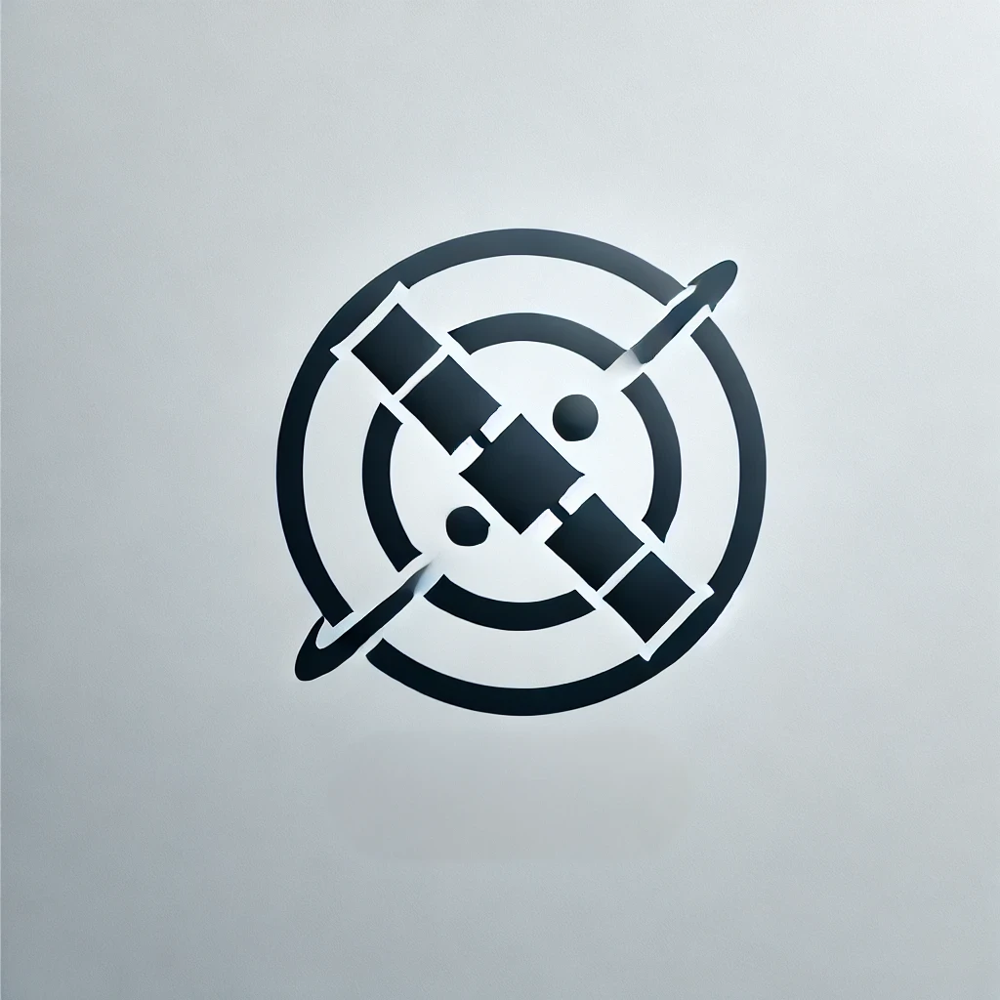

 

<h1>Zalileo</h1>
<italic><strong>Babe I'm with my boss... here is the proof.</strong></italic>

 

Zalileo implements a Zero-Knowledge Proof of Location (ZKPoL) protocol, allowing users to prove their location without revealing exact coordinates.

## Installation 

## Try it out 

## How does it work ?

### Proving
In the proving phase, Zalileo uses a Zero-Knowledge Proof program written in Rust, running on the RISC0 platform. It takes secp256r1 and ECDSA signatures from the Galileo satellite constellation and generates a proof that confirms the validity of these signatures without exposing any details about the location.

### Validation
During validation, the proof generated in the proving phase is used to verify the authenticity of the location data. This process ensures that the location is genuine while maintaining the confidentiality of the exact coordinates.
